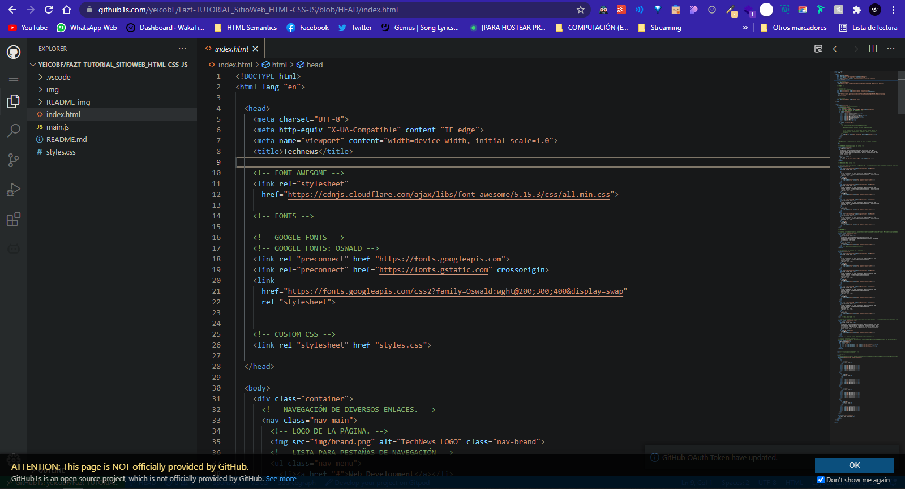

# [TUTORIAL] Sitio Web con HTML, CSS y Javascript (Flexbox, CSS Grid y ScrollReveal) | Technews

Este proyecto está porque seguí un tutorial para desarrollar un sitio web, ya
que tengo un proyecto en donde tengo que desarrollar otro sitio web, pero hace
tiempo que no utilizo HTML, CSS y JS, por lo que quiero hacerlo para tener una
mejor guía de inicio.

## FUENTES

- [[YT / Fazt] Sitio Web con HTML, CSS y Javascript (Flexbox, CSS Grid y ScrollReveal) | Technews [Duración: 01:25:59]](https://youtu.be/Q2imkhmhOFo
  "[YT / Fazt] Sitio Web con HTML, CSS y Javascript (Flexbox, CSS Grid y
  ScrollReveal) | Technews [Duración: 01:25:59]")
- [GitHub / FaztWeb | 💻 Código final del proyecto](https://github.com/FaztWeb/technews-html "GitHub / FaztWeb | 💻 Código final del proyecto")
- [https://www.w3schools.com/css/css3_variables.asp](https://www.w3schools.com/css/css3_variables.asp "https://www.w3schools.com/css/css3_variables.asp")
- [https://stackoverflow.com/questions/26950101/emmet-abbreviations-text-inside-an-element-tag](https://stackoverflow.com/questions/26950101/emmet-abbreviations-text-inside-an-element-tag "https://stackoverflow.com/questions/26950101/emmet-abbreviations-text-inside-an-element-tag")
- [Emmet Documentation / Abbreviations Syntax](https://stackoverflow.com/questions/26950101/emmet-abbreviations-text-inside-an-element-tag "Emmet Documentation / Abbreviations Syntax")
- [Stack Overflow | How do I auto-resize an image to fit a 'div' container?](https://stackoverflow.com/questions/3029422/how-do-i-auto-resize-an-image-to-fit-a-div-container "Stack Overflow | How do I auto-resize an image to fit a 'div' container?")

## FECHAS DE INICIO Y TERMINACIÓN

- Iniciado el: Lunes, 21 de JUNIO del 2021.
- Terminado el: -.

## **GitHub1s**: VISUALIZAR REPOSITORIO DESDE INTERNET COMO EN UN IDE

Desde la misma web es posible visualizar un repositorio en modo de solo lectura
con la peculiaridad de que aparece con una interfaz gráfica parecida a la de
Visual Studio Code.

Para acceder a esta funcionalidad, la cual no es oficial de GitHub, sino que es
un proyecto de **_Open Source_**, hay que agregar un "**1s**" después del
"**`github`**" en el enlace.

> Ejemplo de enlace con este repositorio:
>
> - Enlace original de mi repositorio:
>   [**https://github.com/yeicobF/Fazt-TUTORIAL_SitioWeb_HTML-CSS-JS**](https://github.com/yeicobF/Fazt-TUTORIAL_SitioWeb_HTML-CSS-JS "Enlace original de mi repositorio")
>
> - Enlace que activa la UI:
>   [**https://github1s.com/yeicobF/Fazt-TUTORIAL_SitioWeb_HTML-CSS-JS/blob/HEAD/index.html**](https://github1s.com/yeicobF/Fazt-TUTORIAL_SitioWeb_HTML-CSS-JS/blob/HEAD/index.html "Enlace que activa la UI")



> - [Repositorio GitHub del proyecto | conwnet / github1s](https://github.com/conwnet/github1s "Repositorio GitHub del proyecto | conwnet / github1s")

## RECOMENDACIÓN PARA IMÁGENES

No colocar imágenes de peso tan grandes.

## LIVE SERVER

Liver Server es una extensión de Visual Studio Code que permite crear un
servidor local para ejecutar nuestro sitio web. Esto hace que al guardar los
cambios de nuestro trabajo, se reflejen automáticamente en el servidor.

## FONT AWSOME CDN

Se tuvo que hacer uso del CDN (Content Delivery Network) para poder utilizar
Font Awesome en CSS sin tener que descargar los íconos ni nada.

> **Enlace general**:
> [cdnjs | Home / Libraries / font-awesome](https://cdnjs.com/libraries/font-awesome "cdnjs | Home / Libraries / font-awesome")
>
> Enlace al CDN utilizado:
> [https://cdnjs.cloudflare.com/ajax/libs/font-awesome/5.15.3/css/all.min.css](https://cdnjs.cloudflare.com/ajax/libs/font-awesome/5.15.3/css/all.min.css "CDN de Font Awesome para CSS utilizado")

## HERO PATTERNS

Permite generar diversos diseños de patrones para fondos y cosas así.

> Enlace:
> [https://www.heropatterns.com/](https://www.heropatterns.com/ "https://www.heropatterns.com/")

## GOOGLE FONTS

Fuentes de un CDN.

> FUENTES UTILIZADAS:
>
> - [Oswald](https://fonts.google.com/specimen/Oswald?query=oswald "Oswald")
>   - Extra Light 200
>   - Light 300
>   - Regular 400

## IMÁGENES GRATUITAS

[pexels.com](pexels.com "pexels.com")

## ENLACES EN **`target="_blank"`** PARA SEGURIDAD - **`noopener noreferrer`**

Ya que a través de una página a la que se mande, no pueda alterar la nuestra, en
cuanto a seguridad. Por esto enviamos el enlace de la forma indicada debajo,
para evitar ciertas vulnerabilidades.

> `referer`: Envía la URL desde la que viene, la búsqueda de donde viene el
> usuario, ... Utilizar con este si tenemos control sobre el sitio al que
> enviamos con el enlace.

```html
<a rel="noopener noreferrer" target="_blank" href="enlace"></a>
```

## ABREVIATURAS QUE UTILICÉ CON EMMET

Utilicé abreviaturas con Emment para optimizar el trabajo, pero sigo
aprendiendo.

> - Agregar atributos a una etiqueta:
>
>   `etiqueta[atributo1="" atributo2="" ...]`
>
> - Agregar un número secuencial se utiliza el signo de dinero -> `$`:
>
>   `etiqueta{texto$}*numero-a-repetir-etiqueta`

```html
<!-- header.showcase>h2{Big News Today}+p{lorem30} -->
<!-- RESULTADO -->
<header class="showcase">
  <h2>Big News Today</h2>
  <!-- [lorem30]: Al dar Ctrl + Tab se agrega un lorem de 30 palabras. -->
  <p>lorem30</p>
</header>

<!-- a{Read More}>(i.fas.fa-angle-double-right) -->
<!-- RESULTADO -->
<a href="">Read More<i class="fas fa-angle-double-right"></i></a>

<!-- div.news-cards>div>img+h3{lorem3}+p{lorem20}+(a{Learn More}>(i.fas.fa-angle-double-right)) -->
<!-- RESULTADO -->
<div class="news-cards">
  <div>
    
    <h3>lorem3</h3>
    <p>lorem20</p>
    <a href="">Learn More<i class="fas fa-angle-double-right"></i></a>
  </div>
</div>

<!--
div.news-cards>div>img{./img/news$.jpg}*4+h3{lorem3}+p{lorem20}+a{Learn More}>(i.fas.fa-angle-double-right)
-->
<div class="news-cards">
  <div>
    ./img/news1.jpg</img>
    ./img/news2.jpg</img>
    ./img/news3.jpg</img>
    ./img/news4.jpg</img>
    <h3>lorem3</h3>
    <p>lorem20</p>
    <a href="">Learn More<i class="fas fa-angle-double-right"></i></a>
  </div>
</div>

<!-- div.news-cards>div>img[src="./img/news$.jpg" alt="News $"]*4+h3{lorem3}+p{lorem20}+a[href="#"]{Learn More}>(i.fas.fa-angle-double-right) -->
<div class="news-cards">
  <div>
    
    
    
    
    <h3>lorem3</h3>
    <p>lorem20</p>
    <a href="#">Learn More<i class="fas fa-angle-double-right"></i></a>
  </div>
</div>

<!-- div.news-cards>(div>img[src="./img/news$.jpg" alt="News $"]+h3{lorem3}+p{lorem20}+a[href="#"]{Learn More}>(i[aria-hidden="true"].fas.fa-angle-double-right))*4 -->
<div class="news-cards">
  <div>
    
    <h3>lorem3</h3>
    <p>lorem20</p>
    <a href="#">Learn More<i aria-hidden="true"
        class="fas fa-angle-double-right"></i></a>
  </div>
  <div>
    
    <h3>lorem3</h3>
    <p>lorem20</p>
    <a href="#">Learn More<i aria-hidden="true"
        class="fas fa-angle-double-right"></i></a>
  </div>
  <div>
    
    <h3>lorem3</h3>
    <p>lorem20</p>
    <a href="#">Learn More<i aria-hidden="true"
        class="fas fa-angle-double-right"></i></a>
  </div>
  <div>
    
    <h3>lorem3</h3>
    <p>lorem20</p>
    <a href="#">Learn More<i aria-hidden="true"
        class="fas fa-angle-double-right"></i></a>
  </div>
</div>

<!-- section.cards-banner-one>div.content>h2{lorem3}+p{lorem20}+a[href="#"]{Learn More}.btn>(i[aria-hidden="true"].fas.fa-angle-double-right) -->
<section class="cards-banner-one">
  <div class="content">
    <h2>Lorem, ipsum dolor.</h2>
    <p>
      Lorem ipsum dolor sit amet consectetur adipisicing elit.
      Consequuntur fuga similique sed aut molestias inventore earum eum
      ipsum dolorum laboriosam!
    </p>
    <a href="#" class="btn">
      Learn More
      <i aria-hidden="true" class="fas fa-angle-double-right"></i>
    </a>
  </div>
</section>

<!-- section.cards-banner-2>.content>h2{lorem3}+p{lorem30}+a[href="#"].btn{Learn More}>(i[aria-hidden="true"].fas.fa-angle-double-right) -->
<section class="cards-banner-two">
  <div class="content">
    <h2>Lorem, ipsum dolor.</h2>
    <p>
      Lorem ipsum dolor sit amet consectetur, adipisicing elit. Sint ipsa
      natus maiores magni quibusdam repudiandae consequuntur quasi ipsum,
      ullam nesciunt error illum, voluptates nostrum modi dignissimos ea
      alias. Iusto, odio.
    </p>
    <a href="#" class="btn">
      Learn More
      <i aria-hidden="true" class="fas fa-angle-double-right"></i>
    </a>
  </div>
</section>

<!-- section.social>p{Follow Technews}+div.links>(a[href="#"]>(i[aria-hidden="true"].fab.fa-marca))*3 -->
<section class="social">
  <p>Follow Technews</p>
  <div class="links">
    <a href="#"><i aria-hidden="true" class="fab fa-marca"></i></a>
    <a href="#"><i aria-hidden="true" class="fab fa-marca"></i></a>
    <a href="#"><i aria-hidden="true" class="fab fa-marca"></i></a>
  </div>
</section>

<!-- footer.footer-links>div.footer-container>(ul>(li>a[href="#"]>h3{Title One})+(li>a[href="#"]{Blockchain})*5)*4 -->
<footer class="footer-links">
  <div class="footer-container">
    <ul>
      <li>
        <a href="#">
          <h3>Title One</h3>
        </a>
      </li>
      <li><a href="#">Blockchain</a></li>
      <li><a href="#">Blockchain</a></li>
      <li><a href="#">Blockchain</a></li>
      <li><a href="#">Blockchain</a></li>
      <li><a href="#">Blockchain</a></li>
    </ul>
    <ul>
      <li>
        <a href="#">
          <h3>Title One</h3>
        </a>
      </li>
      <li><a href="#">Blockchain</a></li>
      <li><a href="#">Blockchain</a></li>
      <li><a href="#">Blockchain</a></li>
      <li><a href="#">Blockchain</a></li>
      <li><a href="#">Blockchain</a></li>
    </ul>
    <ul>
      <li>
        <a href="#">
          <h3>Title One</h3>
        </a>
      </li>
      <li><a href="#">Blockchain</a></li>
      <li><a href="#">Blockchain</a></li>
      <li><a href="#">Blockchain</a></li>
      <li><a href="#">Blockchain</a></li>
      <li><a href="#">Blockchain</a></li>
    </ul>
    <ul>
      <li>
        <a href="#">
          <h3>Title One</h3>
        </a>
      </li>
      <li><a href="#">Blockchain</a></li>
      <li><a href="#">Blockchain</a></li>
      <li><a href="#">Blockchain</a></li>
      <li><a href="#">Blockchain</a></li>
      <li><a href="#">Blockchain</a></li>
    </ul>
  </div>
</footer>
```
